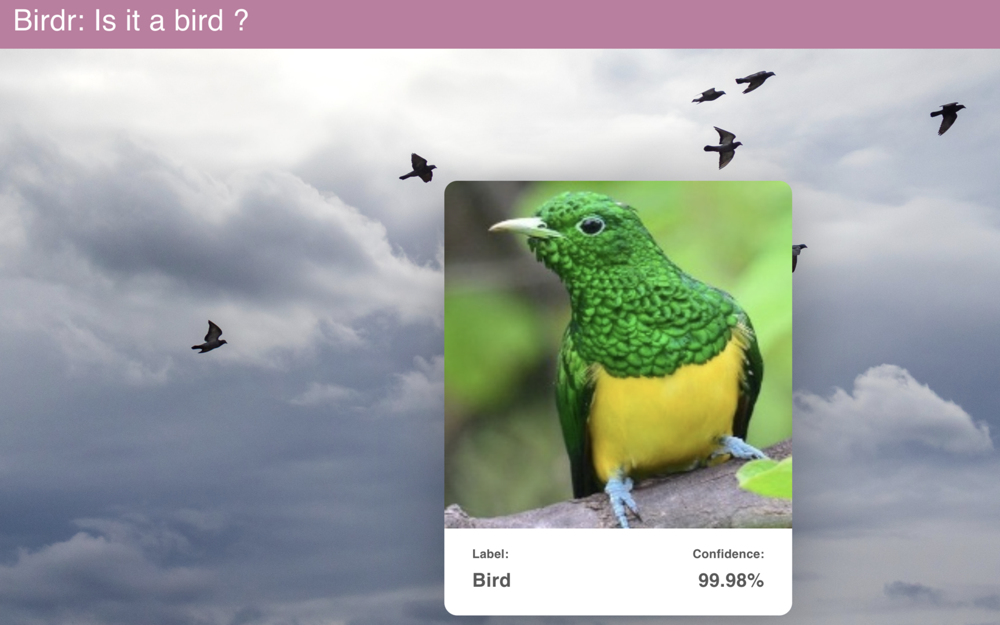

# Birdr
Machine learning model to classify bird built using EfficientNetB0 as the base model, and trained with open source bird dataset from Kaggle. The model is able to classify bird with 99.7% accuracy.

Check out the web app [here]("https://birdr-99958.web.app")

[Link to dataset](https://www.kaggle.com/datasets/gpiosenka/100-bird-species)
